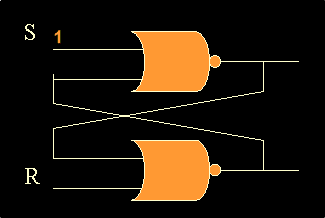

<h1>Verilog: The Backbone of Digital Design in Electronics and Information Technology</h1>

Verilog is a hardware description language (HDL) widely used in the field of Electronics and Information Technology for designing and modeling digital systems. 
It provides engineers with the ability to describe the behavior and structure of electronic circuits, from simple gates to complex integrated circuits (ICs). 
Through Verilog, engineers can create accurate models of digital systems, simulate their behavior, and test various design scenarios before physically implementing them. 
This capability reduces the time and costs associated with hardware prototyping and helps identify potential issues early in the design process.

In the context of Electronics, Verilog plays a crucial role in designing field-programmable gate arrays (FPGAs) and application-specific integrated circuits (ASICs). 
These devices are integral to modern electronic systems, powering everything from consumer electronics to telecommunications and automotive systems. With Verilog, 
engineers can write concise, reusable code to describe a range of digital logic behaviors, enabling the efficient design of custom chips tailored to specific applications. 
This makes Verilog a fundamental tool for the development of high-performance hardware systems, fostering innovation in a variety of industries.

  

In the realm of Information Technology, Verilog is essential for systems that require real-time processing and efficient data handling. Verilog's ability to 
model parallel processing elements and control systems makes it a vital language in the development of embedded systems, networking devices, and microprocessor designs.
By using Verilog, designers can optimize hardware for speed, power consumption, and reliability, ensuring that IT systems run efficiently under demanding conditions. 
Additionally, Verilog plays an important role in enabling the growth of emerging technologies such as artificial intelligence and the Internet of Things (IoT), where 
customized hardware accelerators and efficient data throughput are critical.

  

